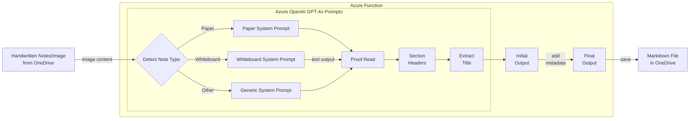

# Handwriting-to-Markdown-GPT
This repo reads notes from a notebook, paper, or whiteboard and converts it into Markdown (*.md) using GenAI.

This code is the next iteration of a previous [Handwriting-to-Markdown](https://github.com/raffertyuy/Handwriting-to-Markdown/tree/main) Azure Logic App which was doing something similar but using Azure AI Services - Computer Vision.
In this implementation, Azure OpenAI `gpt-4o` is used instead.
- `./az-function` contains the main code using python and deployed to Azure Functions
- `./az-logicapp` contains code that triggers when a photo is added in a OneDrive source folder, and creates an `.md` file in a OneDrive target folder

Also see this [blog post](https://raffertyuy.com/raztype/handwriting-to-second-brain-gpt/)

## Solution Flow
This solution is using Azure Logic Apps with the following flow:
1. Watch for new files in a specific OneDrive folder
2. Check for GPT-4o supported image formats
   - if the filetype is PDF, convert to JPG using [OneDrive - Convert File](https://learn.microsoft.com/en-us/connectors/onedrive/#convert-file-(preview)) (limited to the first page of the PDF file).
   - if the filetype is not supported, skip.
3. Extract the text from the image file using GPT-4o (through a Function App).
4. Copy the image and save a new markdown file output in a destination OneDrive folder.



> [!NOTE]
> Prompt Flow was previously attempted, but the following gaps were encountered (as of 2024-06-28):
> - Prompt Flow in VS Code doesn't support an `image` input type.
> - Prompt Flow on [AI Studio](https://ai.azure.com) doesn't support GPT-4o (but GPT-4V is available in preview)


## Instructions for Running Locally and for Deployment
There is no one-click deployment for this solution yet. If you want to try, feel free to [Contribute](./CONTRIBUTING.md).
For now, here are the manual instructions.

### Pre-requisites
1. An active [Azure Subscription](https://azure.microsoft.com)
2. An Azure OpenAI resource
3. An Azure Key Vault resource

### Running Locally
This app requires Microsoft Azure and can't be run locally. However, you may do the following to try and test the output:
1. Run the Jupyter [notebook](./notebooks/notebook.ipynb)
  - Create a `.env` file (refer to `.env.example`)
  - Modify the image path in this cell `IMAGE_PATH="../media/notes-sample.png"`
  - Run the notebook
2. Run the Azure Function locally
  - Install the [Azure Functions Core Tools](https://learn.microsoft.com/en-us/azure/azure-functions/functions-develop-local)
  - Create a file `local.settings.json` (refer to `local.settings.example.json`)
  - Go to the local CLI and run `func start`

> [!NOTE]
> The current code assumes that you have an Azure Identity with the necessary access to your Azure OpenAI resource. To do so:
> 1. Go to the [Azure Portal](https://portal.azure.com)
> 2. Go to your Azure OpenAI resource
> 3. Go to the **Access control (IAM)** tab
> 4. Add a role assignment, and add yourself with the role [Cognitive Services OpenAI User](https://learn.microsoft.com/en-us/azure/ai-services/openai/how-to/role-based-access-control#cognitive-services-openai-user) (or Contributor).

### Azure Deployment
1. Deploy the Azure Function
  - Opening the source in [VS Code](https://code.visualstudio.com/)
  - Installing the [Azure Functions](https://marketplace.visualstudio.com/items?itemName=ms-azuretools.vscode-azurefunctions) extension
  - In the _Explorer_ pane, right-click the `az-function` folder, and then click **Deploy to Function App...**
  - Test the function using the **Test & View Output** button

2. Add Azure Function key in the Key Vault
 - Go to the deployed Azure Function
 - Go to the **App keys** tab and copy the _default_ function key
 - Go to your Azure Key Vault resource (one of the [pre-requisites](#pre-requisites))
 - Go to **Secrets** and add the function key as a secret

3. Deploy the Azure Logic App
  - Going to the [Azure Portal](https://portal.azure.com)
  - In the search bar, search for _"Template Deployment"_
  - Load the `./az-logicapp/azuredeploy.json` file
  - Fill in the required parameters
  - Deploy

4. Configure Azure Logic App Idenity
  - Go to the deployed Azure Logic App
  - Click the **Identity** tab
  - Click _"Identity"_ → _"System assigned"_, and then turn `Status = On`
  - Add a role assignment, and add the Logic App with the role `Key Vault Secrets User`


5. Check Azure Logic App connections
  - Check and fix the connection to your personal OneDrive account
  - Check and fix the connection to your Azure Key Vault
  - After deployment, go to the Logic App
  - Click _"Identity"_ → _"System assigned"_, and then turn `Status = On`

> [!TIP]
> - If you need to troubleshoot, check [code.json](/az-logicapp/azuredeploy.json). This is the copy-pasted code from the Logic App designer, included for reference.
> - If you're wondering why I didn't use managed identities to authorize the Logic App to the Azure Function, see [Logic App Notes](#logic-app-notes) below.


## Azure Function Notes
### Python Programming Model
This Azure function is developed using the [Python v2 programming model](https://learn.microsoft.com/en-us/azure/azure-functions/functions-reference-python?tabs=asgi%2Capplication-level&pivots=python-mode-decorators) and is deployed using the [VS Code Extension: Azure Functions](https://marketplace.visualstudio.com/items?itemName=ms-azuretools.vscode-azurefunctions).

> [!TIP]
> Sometimes, the function does not show up on Azure after deploying. This usually happens when there is an error in the code. For example:
> - a missing dependency in the requirements.txt file
> - a missing environment variable in Azure (that is currently in `local.settings.json`)
> - or an actual error in the code.

> [!NOTE]
> There is a previous attempt to have this consumed by logic apps using the Azure Function connector and Managed Identiites. It didn't work due to complexity of using MI with `multipart/form-data`. But here are additional notes in this previous attempt:
> - To call Azure Functions using managed identities, the function method must be set to `ANONYMOUS` and configured for [managed identity authentication](https://learn.microsoft.com/en-us/azure/logic-apps/call-azure-functions-from-workflows?tabs=consumption#set-authentication-function-app)
> - Azure Logic Apps can't call Azure Functions with custom routes. For Python, this means leaving the route empty with `@app.route(route="")` as suggested in [this issue](https://github.com/Azure/azure-functions-python-worker/issues/1468).

For the current implementation, this function's `AuthLevel` is set to `FUNCTION`. Meaning, a function key is expected to be passed in the request.

## Logic App Notes

### Authentication
To authenticate with the Azure Function, a function key stored in Azure Key Vault is used.

### Sending a `multipart/form-data` HTTP POST
Since we're passing a OneDrive file to Azure Functions as a `multipart/form-data`, the HTTP request body should look like this.
```json
{
    "$content-type": "multipart/form-data",
    "$multipart": [
        {
            "body": ATTACHMENTS_CONTENT,
            "headers": {
                "Content-Disposition": "form-data; name=image; filename=\"ATTACHMENTS_NAME\"",
                "Content-Type": "ATTACHMENTS_CONTENT_TYPE"
            }
        }
    ]
}
```

> [!NOTE]
> I eventually used the **HTTP Request** connector instead of an **Azure Functions** connector.
> This is because the response body is in JSON, and the Azure Functions connector returns this in a JSON-escaped string format.
> Since I'm using Obsidian for my second brain, my final markdown image link uses `![[image_path]]` instead of the standard `` format.