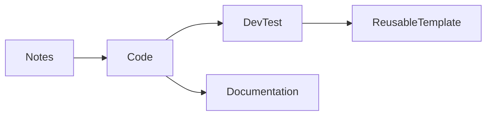

# notes-sample.png

## #0240701 My Test Notes

This is me, randomly writing something to test my app.

### Attendees:
Riff, Raynor, Jim, John, Kerrigan, Annie

## MOTM

Top priorities
- More apps using Gen AI
- Use GitHub Copilot!
- How to integrate with Azure
- CI/CD?

### Note:
- This is written in markdown
- I should include drawings

| July    | August     | September  |
|---------|------------|------------|
| Comms   | Enablement | Execution  |
| Meetings| Workshops  | Metrics    |

^ Hope this makes sense?

_Let's write in script._