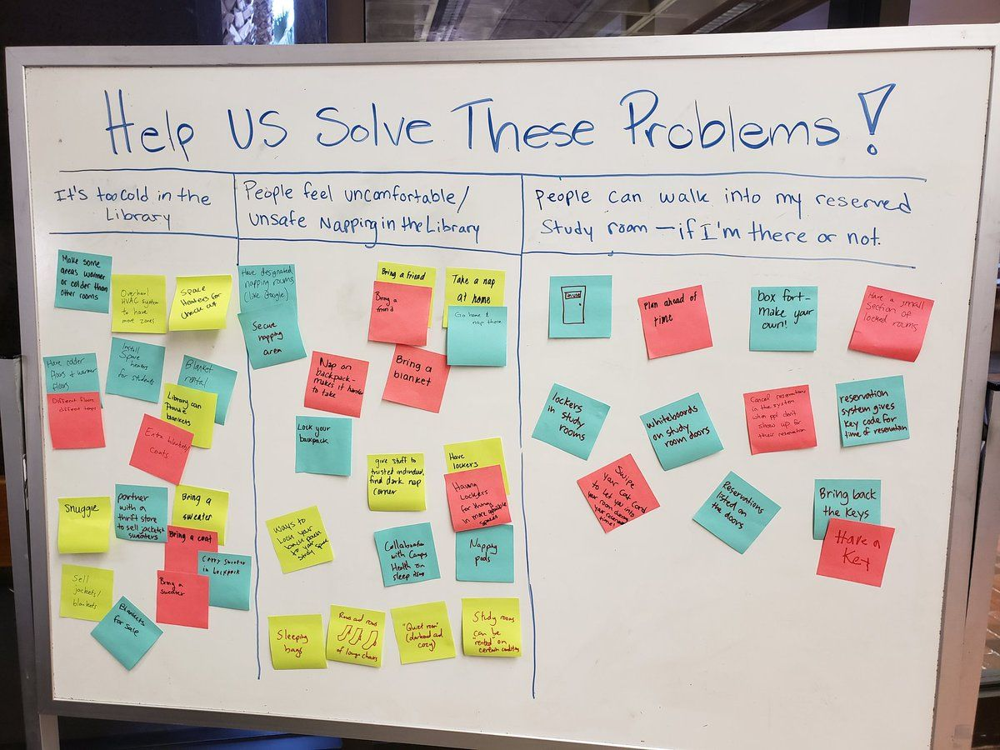

# image-whiteboard-stickynotes.png

# Help Us Solve These Problems!

## Temperature Issues

- Make some areas warmer or colder than other rooms
- Space heaters/blankets
- Have indoor plants
- Smell better
- Blanket rental
- Library can provide blankets
- Bring a sweater
- Partner with local stores to sell special sweaters
- Bring a sweater
- Carry sweaters in a backpack
- Snuggle
- Self-heating blankets
- Bring a blanket

## Napping Concerns

- Have designated nap areas (like Google)
- Secure your bag
- Nap on a mat/take a break
- Lock your backpack
- Bring a friend
- Bring a blanket
- Take a nap at home
- Give staff a budget window for a nap corner
- Have lockers
- Nap pods
- Sleeping bag
- Wear socks to keep warm
- Create a designated nap corner
- Study rooms

## Study Room Security

- Plan ahead of time
- Box fort - make your own!
- Have a small section of locked rooms
- Lockers in study rooms
- Whiteboards on study room doors
- Card reservation system to show the room is reserved
- Reservation system gives key code for reservation
- Bring back the keys
- Have a key
- Swipe your ID card to enter
- Reservations on the doors