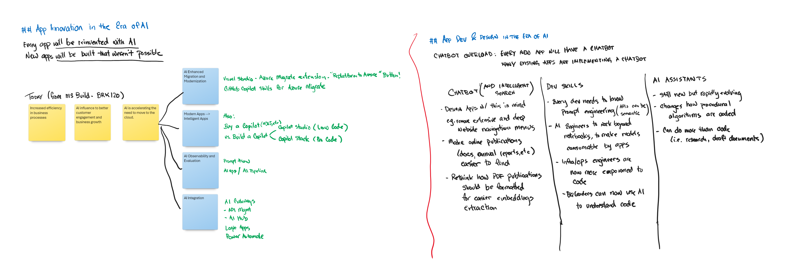

# whiteboard-full-sample.png

## App Innovation in the Era of AI

Every app will be reinvented with AI.  
New apps will be built that weren't possible.

### Current Trends

- Increased efficiency in business processes
- AI influence to better customer engagement and business growth
- AI is accelerating the need to move to the cloud.

#### Migration and Modernization

- Visual Studio - Azure Migrate extension: "Replatform to Azure"
- GitHub Copilot skills for Azure Migrate

#### Intelligent Apps

- Buy a Copilot (Microsoft 365, etc.) vs. Build a Copilot (Copilot Stack: Professional Code)
- Copilot Studio (Low Code)

#### Observability and Evaluation

- Prompt flow
- AI apps / AI pipeline

#### Integration

- AI Gateways
  - API Management
  - AI Hub
- Logic Apps
- Power Automate

## App Development and Design in the Era of AI

### Chatbot Integration

Many existing apps are implementing a chatbot.

#### Design Considerations

- Design apps with this in mind
  - e.g., remove extensive and deep website navigation menus
- Make online publications (documents, annual reports, etc.) easier to find
- Rethink how PDF publications should be formatted for easier embeddings extraction

#### Development Skills

- Every developer needs to know prompt engineering (AIs can be semantic)
- AI engineers to work beyond notebooks, to make models consumable by apps
- Infrastructure/Operations engineers are now more empowered to code
- Business leaders can now use AI to understand code

#### AI Assistants

- Still new but rapidly evolving
- Changes how procedural algorithms are coded
- Can do more than code (i.e., research, draft documents)